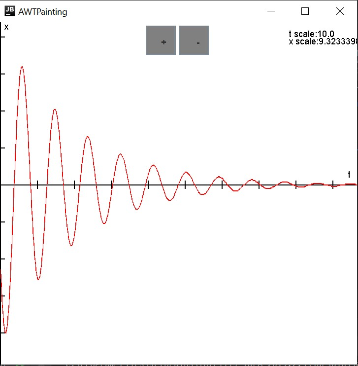
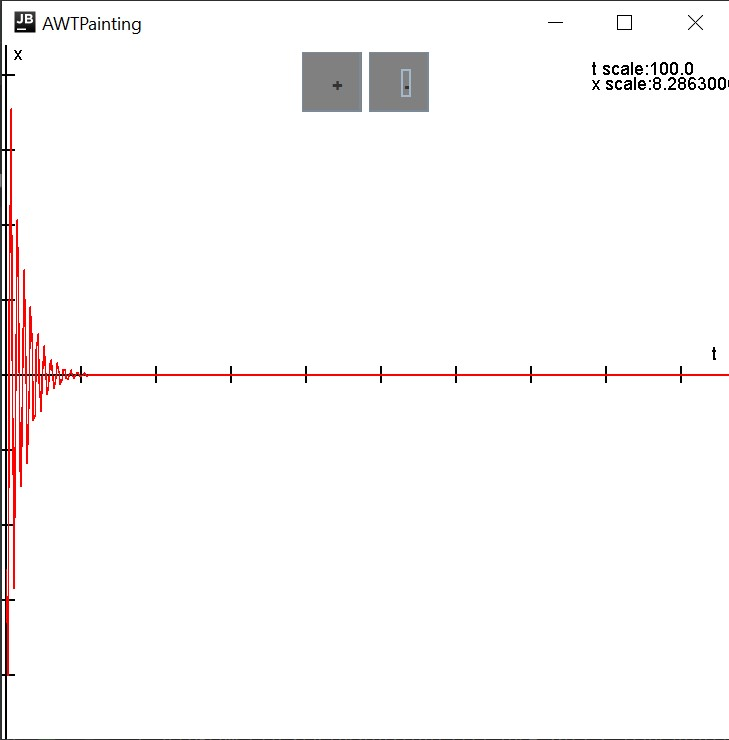
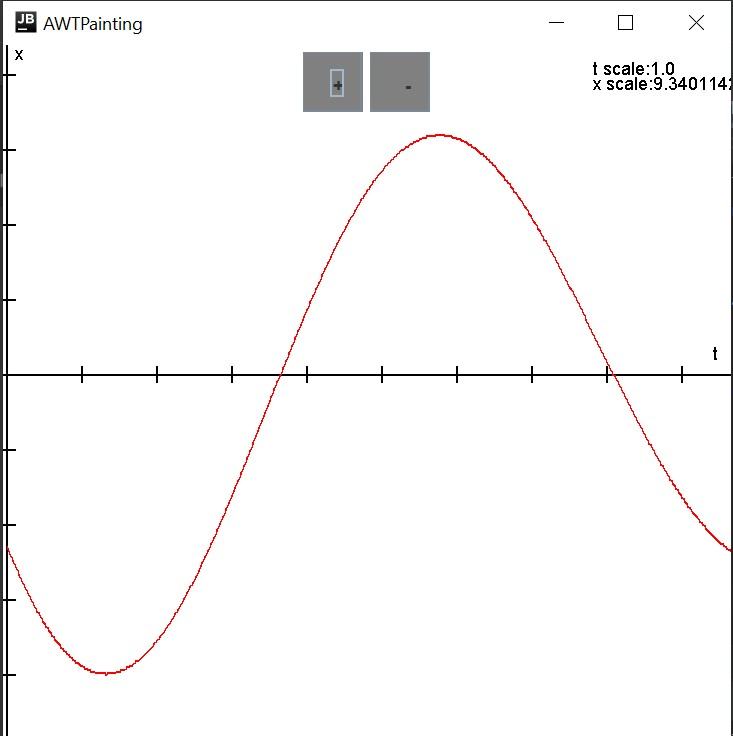

## Модель пружины с шайбой в однородном магнитном поле
Реализовано через Java Swing

#### Теория
Обоснование данной модели предложено в файле theory.pdf

#### Входные данные:
Входные данные передаются через файл input.txt. Числа, в формате double в порядке: h0, m, μ, k, F0, ω, φ0. 
h0 - начальное положение 
m - масса шайбы 
μ - коэффициент вязкого трения 
k - жесткость пружины 
F0 - сила воздействия поля на шайбу 
ω - частота поля 
φ0 -начальная фаза 

#### Интерфейс

Программа визуализирует предложенную модель, на выход пользователю предлагается график, где масштаб по оси t меняется с помощью кнопок '+' и '-', а масштаб по оси x(t) регулируется автоматически. Текущий масштаб отображен в правом верхнем углу. 4 риски по оси x(t) обозначают 100% x scale, 10 рисок по оси t обозначают 100% t scale

#### Пример
Пример работы программы на input.txt = {10
                                        1
                                        1
                                        200
                                        0,1
                                        1
                                        1}: 

